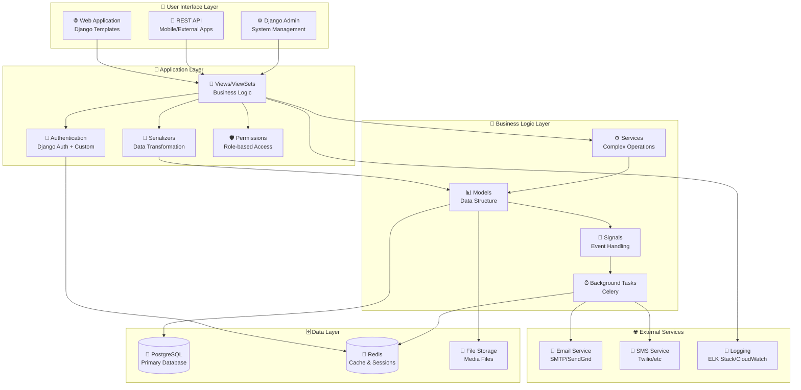

# 🏥 Hospital Management System

> ระบบจัดการโรงพยาบาล แบบครบวงจร สำหรับการนัดหมาย การตรวจรักษา และการจัดการข้อมูลผู้ป่วย

## 📋 สารบัญ

- [🎯 ภาพรวมระบบ](#-ภาพรวมระบบ)
- [⚡ คุณสมบัติหลัก](#-คุณสมบัติหลัก)
- [🛠️ เทคโนโลยีที่ใช้](#️-เทคโนโลยีที่ใช้)
- [🏗️ สถาปัตยกรรมระบบ](#️-สถาปัตยกรรมระบบ)
- [🔄 Flow การทำงาน](#-flow-การทำงาน)
- [📊 ER Diagram](#-er-diagram)
- [🚀 การติดตั้ง](#-การติดตั้ง)
- [📖 การใช้งาน](#-การใช้งาน)

---

## 🎯 ภาพรวมระบบ

**Hospital Management System** เป็นระบบจัดการโรงพยาบาลแบบครบวงจร ที่พัฒนาด้วย Django และ PostgreSQL เพื่อช่วยให้การดำเนินงานของโรงพยาบาลเป็นไปอย่างมีประสิทธิภาพ

### 🎪 ปัญหาที่แก้ไข

- **📝 การนัดหมายแบบกระดาษ** → ระบบนัดหมายออนไลน์
- **📋 บันทึกการรักษาแบบเก่า** → Medical Records ดิจิทัล
- **⏰ การจัดคิวที่ไม่มีระบบ** → ระบบคิวอัตโนมัติ
- **💊 การจัดการยาที่ยุ่งยาก** → ระบบจัดการยาและใบสั่งยา
- **👥 การติดตามผู้ใช้ที่ไม่มีประสิทธิภาพ** → ระบบ Audit Trail

### 🏆 เป้าหมาย

1. **ลดเวลารอคอย** ของผู้ป่วยด้วยระบบคิวอัตโนมัติ
2. **เพิ่มความปลอดภัย** ของข้อมูลด้วยระบบ Authentication & Authorization
3. **ปรับปรุงประสิทธิภาพ** การทำงานของบุคลากรทางการแพทย์
4. **สร้างความโปร่งใส** ด้วยระบบติดตามการเปลี่ยนแปลงข้อมูล

---

## ⚡ คุณสมบัติหลัก

### 👥 การจัดการผู้ใช้งาน
- **ผู้ป่วย (Patient)**: นัดหมาย, ดูประวัติการรักษา, รับการแจ้งเตือน
- **แพทย์ (Doctor)**: จัดการการนัด, บันทึกการรักษา, สั่งยา
- **พยาบาล (Nurse)**: ช่วยเหลือแพทย์, จัดการคิว
- **เจ้าหนาที่ (Staff)**: จัดการข้อมูลทั่วไป
- **ผู้ดูแลระบบ (Admin)**: จัดการระบบทั้งหมด

### 📅 ระบบการนัดหมาย
- **📝 สร้างการนัด**: ระบุแพทย์, วันที่, เวลา, อาการ
- **✅ ยืนยันการนัด**: แพทย์/เจ้าหนาที่ยืนยันการนัด
- **🔄 เลื่อนการนัด**: เปลี่ยนวันเวลาพร้อมแจ้งเตือน
- **❌ ยกเลิกการนัด**: ยกเลิกพร้อมระบุเหตุผล
- **🔍 ตรวจสอบความว่าง**: ป้องกัน Double Booking

### 🏥 ระบบการรักษา
- **📋 Medical Records**: บันทึกการวินิจฉัย, การรักษา, ประวัติ
- **💊 ใบสั่งยา (Prescription)**: สั่งยา, ตรวจสอบสต็อก, ราคา
- **📊 Vital Signs**: บันทึกสัญญาณชีพ (อุณหภูมิ, ความดัน, ชีพจร)

### 🎫 ระบบจัดการคิว
- **🔢 หมายเลขคิว**: สร้างคิวอัตโนมัติตามแผนก
- **📢 เรียกคิว**: ระบบเรียกคิวและแจ้งเตือน
- **📊 สถานะคิว**: ติดตาม รอ → เรียก → กำลังรักษา → เสร็จสิ้น

### 🔔 ระบบการแจ้งเตือน
- **✉️ การนัดหมาย**: แจ้งยืนยัน, เลื่อน, ยกเลิก
- **⏰ เตือนการนัด**: แจ้งก่อนถึงเวลานัด
- **🎫 เรียกคิว**: แจ้งเมื่อถึงคิว

### 🔍 ระบบ Audit Trail
- **👤 created_by/updated_by**: บันทึกว่าใครสร้าง/แก้ไข
- **⏰ created_at/updated_at**: บันทึกเวลาที่สร้าง/แก้ไข
- **🗂️ ติดตามการเปลี่ยนแปลง**: ทุกการแก้ไขข้อมูล

---

## 🛠️ เทคโนโลยีที่ใช้

### 🐍 Backend Framework
```python
Django 4.2+  # Web Framework
```
**เหตุผลที่เลือก Django:**
- **🚀 Rapid Development**: พัฒนาได้เร็ว ด้วย Built-in Features
- **🔐 Security First**: มี Security Features ครบครัน
- **👥 Large Community**: Community ใหญ่ หาความช่วยเหลือได้ง่าย
- **📚 Rich Ecosystem**: มี Package เยอะ ลดการเขียนโค้ดซ้ำ
- **🏥 Enterprise Ready**: เหมาะกับระบบโรงพยาบาลที่ต้องการความเสถียร

### 🌐 API Framework
```python
Django REST Framework (DRF)  # RESTful API
```
**เหตุผลที่เลือก DRF:**
- **📊 Powerful Serialization**: จัดการข้อมูล JSON ได้ดี
- **🔒 Authentication & Permissions**: ระบบสิทธิ์ที่ยืดหยุ่น
- **📖 Auto Documentation**: สร้าง API Docs อัตโนมัติ
- **🧪 Testing Tools**: เครื่องมือ Test API ครบครัน

### 🗄️ Database
```sql
PostgreSQL 15+  # Primary Database
Redis 7+       # Caching & Sessions
```
**เหตุผลที่เลือก PostgreSQL:**
- **🔗 ACID Compliance**: ความสอดคล้องของข้อมูลสูง (สำคัญสำหรับข้อมูลทางการแพทย์)
- **📊 Advanced Data Types**: รองรับ JSON, Array, และ Custom Types
- **⚡ High Performance**: ประสิทธิภาพสูงสำหรับ Complex Queries
- **🔒 Enterprise Security**: ระบบรักษาความปลอดภัยระดับองค์กร
- **📈 Scalability**: รองรับการขยายระบบในอนาคต

**เหตุผลที่เลือก Redis:**
- **⚡ In-Memory Storage**: เร็วมากสำหรับ Caching
- **🔄 Session Management**: จัดการ User Sessions
- **📊 Real-time Features**: รองรับ Pub/Sub สำหรับ Real-time Notifications

### 🐳 Containerization
```docker
Docker & Docker Compose  # Container Management
```
**เหตุผลที่เลือก Docker:**
- **🔄 Consistency**: Environment เหมือนกันทุกที่ (Dev, Test, Prod)
- **🚀 Easy Deployment**: Deploy ได้ง่าย ไม่ต้องกังวลเรื่อง Dependencies
- **📦 Isolation**: แยก Services ออกจากกัน
- **🔧 Easy Setup**: ติดตั้งได้ง่ายด้วย 1 คำสั่ง

### 🔧 Additional Tools
```yaml
Celery:     # Background Tasks (Email, Notifications)
Nginx:      # Web Server & Load Balancer  
Gunicorn:   # WSGI Server
pytest:     # Testing Framework
```

---

## 🏗️ สถาปัตยกรรมระบบ



### 📚 Layer Responsibilities

#### 🎨 **User Interface Layer**
- **Web App**: หน้าเว็บสำหรับ Staff, Doctors, Admins
- **REST API**: สำหรับ Mobile Apps หรือ External Systems
- **Django Admin**: สำหรับ System Administration

#### 🧠 **Application Layer**  
- **Authentication**: Login/Logout, Session Management
- **Views**: HTTP Request/Response Handling
- **Serializers**: Data Validation & Transformation
- **Permissions**: Role-based Access Control

#### 💼 **Business Logic Layer**
- **Models**: Core Business Rules & Data Structure
- **Services**: Complex Multi-Model Operations
- **Signals**: Event-driven Actions
- **Background Tasks**: Async Operations (Email, SMS)

#### 🗄️ **Data Layer**
- **PostgreSQL**: